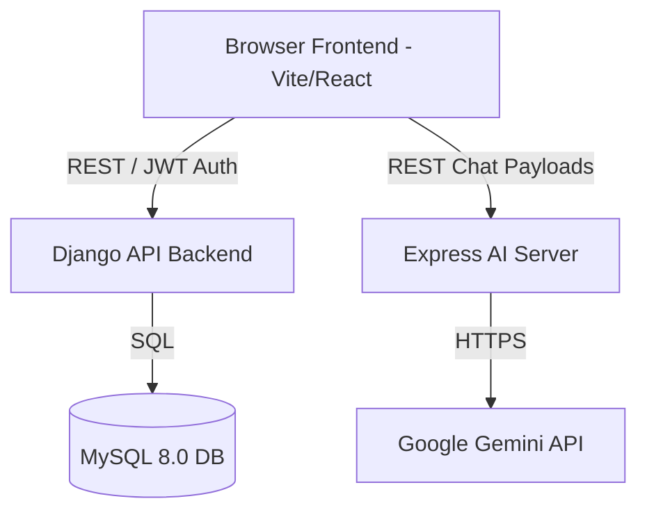

# Tree Sorter – Technological Documentation

> [!NOTE]
> This document provides a high-level overview of the architecture, tech stack, and module organization of the Tree Sorter application.

## 1. System Architecture Overview

Tree Sorter is a modern, decoupled full-stack web application designed for scalability and modularity. It consists of three primary runtime components:

1. **Frontend Client (Port 5173)**: A React Single Page Application (SPA) that serves the user interface.
2. **Core API Backend (Port 8000)**: A Python Django server that handles authentication, core business logic, user profiles, and database operations.
3. **AI Chat Proxy Server (Port 5000)**: A dedicated Node.js Express microservice that acts as an intermediary for Google's Gemini LLM (formerly Ollama), handling streaming AI chat responses securely.

---

## 2. Technology Stack Details

### Frontend (Client-side)
* **Framework**: React 18
* **Build Tool**: Vite (Lightning fast HMR & bundling)
* **Language**: TypeScript for strict typing and better developer experience.
* **Styling**: Tailwind CSS v4 (used alongside `clsx` and `tailwind-merge`).
* **UI Components**: Radix UI (headless accessible components), Lucide React (icons), Sonner (toast notifications).
* **Routing**: React Router v7
* **Data Visualization / Carousels**: Recharts, Embla Carousel.

### Backend (Server-side & API)
* **Framework**: Django 4.2 & Django REST Framework (DRF)
* **Language**: Python 3.10+
* **Authentication**: JSON Web Tokens (JWT) using `djangorestframework-simplejwt` with short-lived access tokens (15m) and long-lived refresh tokens (7d).
* **Database Driver**: PyMySQL (A pure-Python MySQL client).
* **CORS Management**: `django-cors-headers` to safely allow requests from the React frontend.

### AI Microservice
* **Framework**: Express.js (Node v18+)
* **Purpose**: Abstracts API keys away from the client browser and proxies requests to the Gemini `gemini-flash-latest` model.

### Database
* **Engine**: MySQL 8.0+
* **Encoding**: `utf8mb4` (Full unicode support)
* **Users**: Dedicated local user `tree_sorter_user` mapping to both `localhost` and IPv6 `::1`.

---

## 3. Codebase Structure

### `/src` (Frontend)
* **`/app/pages`**: Contains all main views for the application:
  * `HomePage.tsx`, `LoginPage.tsx`, `ProfilePage.tsx`
  * `TreeAssistantPage.tsx`: Interface for the AI Chat bot.
  * `DiseaseScanPage.tsx`: Image upload logic for scanning plant diseases.
  * `PlantsPage.tsx` & `PlantDetailsPage.tsx`: Browsing the encyclopedia of trees/plants.
  * `WeatherPage.tsx`: Weather integration.
* **`/server`**: Contains `server.ts` – this is the Node.js Express server that gets run on Port 5000 via `npm run server`.

### `/backend` (Django Core)
* **`/config`**: The main Django project configuration directory (`settings.py`, `urls.py`).
* **`/accounts`**: The Django app dedicated to user management:
  * Manages user registration, login, JWT token generation (`serializers.py`, `views.py`).
  * Handles user profile data and permissions.
* **`/garden`**: The Django app dedicated to managing the core domain entities (Trees, Plants, User Gardens).

---

## 4. Key Workflows & Features

> [!TIP]
> **Authentication Flow**
> When a user logs in, the React frontend posts credentials to Django's `/api/auth/login/`. Django validates against MySQL and returns an `access` and `refresh` token. The frontend stores these and attaches the `access` token as a `Bearer` token in the `Authorization` header for all subsequent private API calls.

> [!IMPORTANT]
> **AI Chat Architecture**
> The chatbot logic deliberately avoids putting the Gemini API key in the frontend to prevent scraping/theft. Instead, React makes a POST request to `http://localhost:5000/api/chat`. The Express server safely attaches the environment-stored `GEMINI_API_KEY` and forwards the prompt to Google's backend.

---

## 5. Running the Application Locally

For local development, 3 separate terminal processes must be maintained. 
*Note: We use `npm run` scripts to ensure proper environment variables are sourced.*

1. **Django API**: `npm run django:run` (Spawns `backend\manage.py runserver 8000`)
2. **Express Server**: `npm run server` (Spawns Node/tsx on port 5000)
3. **Vite Frontend**: `npm run dev` (Spawns Vite on port 5173)

### Environment Variables
Environment variables are strictly isolated:
* Root `.env`: For Vite `VITE_*` variables, AI Provider keys (`GEMINI_API_KEY`), and Node settings.
* `backend/.env`: For Django secrets, MySQL credentials, and backend debug settings.
